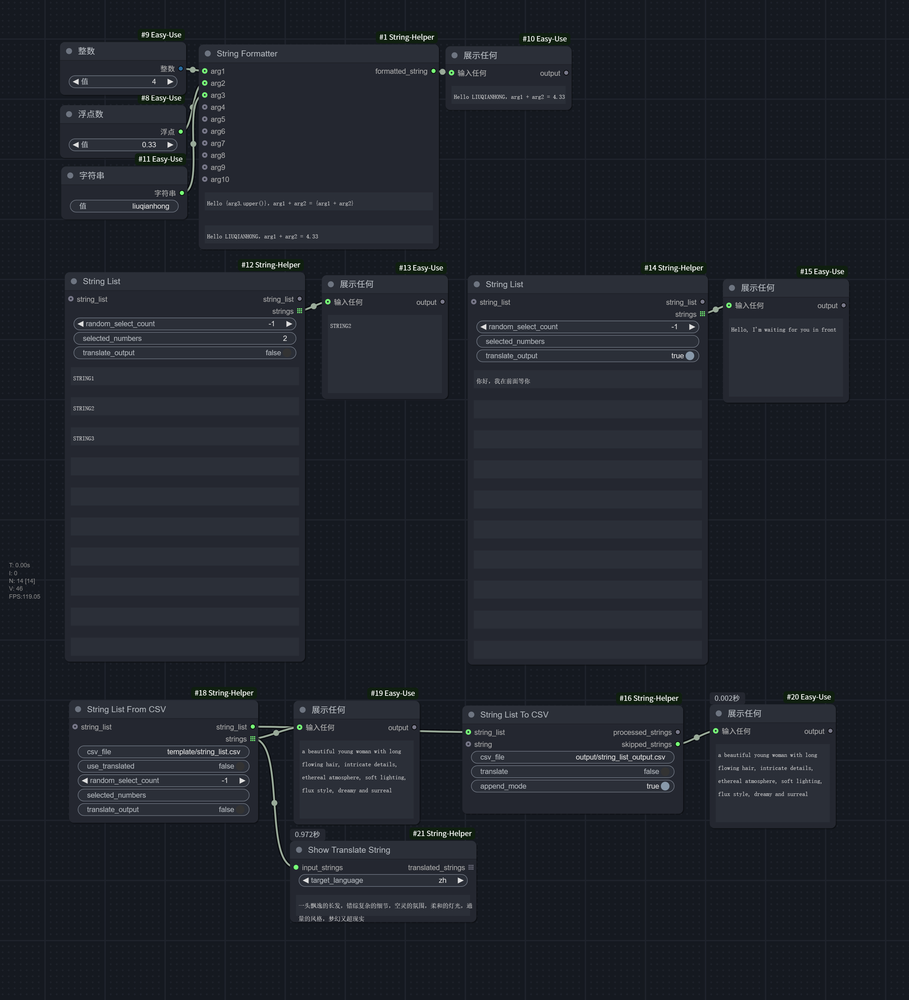

# ComfyUI 字符串自定义节点

ComfyUI的字符串相关的自定义节点，其中包括 String Formatter、StringList 节点。此节点设计旨在提高用户在处理字符串时的效率和灵活性。



> 直接拖入ComfyUI即可使用

## 安装方法

1. 将此仓库克隆到你的 `ComfyUI/custom_nodes` 目录下：
```bash
cd custom_nodes
git clone https://github.com/liuqianhonga/ComfyUI-String-Helper.git
```
2. 重启 ComfyUI

## String Formatter 节点使用说明

字符串格式化节点允许你使用Python的f-string语法来格式化字符串。你可以在模板字符串中引用最多10个输入参数（arg1到arg10）且自由定制模板。对于复杂的语法，需要了解Python的f-string格式化语法。

### 节点参数

- **template** (必需)：使用f-string语法的模板字符串
- **arg1** - **arg10** (可选)：可在模板中引用的输入参数

### 使用示例

1. 基础文本格式化：
```python
arg1: "小明"
arg2: "ComfyUI"

模板: "你好 {arg1}，欢迎来到 {arg2}！"
输出: "你好 小明，欢迎来到 ComfyUI！"
```

2. 数字使用示例：
```python
arg1: 10
arg2: 20
arg3: 30

模板: "计算结果: {arg1} + {arg2} = {arg3}"
输出: "计算结果: 10 + 20 = 30"
```

3. 对象使用示例：
```python
arg1: {"名称": "模型_v1", "类型": "checkpoint"}

模板: "模型信息: {arg1}"
输出: "模型信息: {'名称': '模型_v1', '类型': 'checkpoint'}"
```


### 注意事项

- 未提供的参数（None值）将被忽略
- 节点支持任何类型的输入（字符串、数字、列表、字典等）
- 同一个参数可以在模板中多次使用
- 支持Python f-string的所有格式化特性

### 错误处理

如果模板或格式化过程中出现错误，节点将返回错误信息字符串：
```python
当引用了未提供的参数时：
模板: "你好 {arg1}，{arg2}"
arg1: "世界"
输出: "Format Error: name 'arg2' is not defined"
```

## StringList 节点使用说明

StringList 节点允许你灵活地选择和翻译字符串。你可以通过手动输入、随机选择或指定编号选择字符串，并可选地将其翻译为英文。

### 节点参数

- **random_select_count** (必需)：随机选择字符串的数量。特殊值:
  - `-1`：返回所有输入字符串
  - `0`：返回空列表
  - `1-10`：随机选择指定数量的字符串
- **selected_numbers** (可选)：指定要选择的字符串编号，多个编号用逗号分隔，如"1,3,5"。当此字段有值时，`random_select_count` 失效
- **translate_output** (可选)：布尔值，默认为 `False`。启用后，将选定的字符串从自动检测的语言翻译为英文
- **string1** - **string10** (必需)：多行字符串输入字段，用于手动输入字符串
- **string_list** (可选)：额外的字符串列表输入，用于合并外部字符串列表

### 使用示例

1. 随机选择字符串：
```python
random_select_count: 3
translate_output: False
string1: "你好"
string2: "世界"
string3: "欢迎"
输出: 随机选择3个字符串
```

2. 指定编号选择字符串：
```python
selected_numbers: "1,3"
translate_output: True
string1: "你好"
string2: "世界"
string3: "欢迎"
输出: ["Hello", "Welcome"]
```

2. 指定编号选择字符串：
```python
selected_numbers: "1,3"
translate_output: False
string1: "你好"
string2: "世界"
string3: "欢迎"
输出: ["你好", "欢迎"]
```

3. 使用外部字符串列表：
```python
random_select_count: 2
string_list: ["额外1", "额外2"]
输出: 随机选择2个字符串并合并外部列表
```

## StringListFromCSV 节点使用说明

StringListFromCSV 节点允许你从 CSV 文件中读取和选择字符串。这个节点提供了与 StringList 节点类似的功能，但数据源来自 CSV 文件。节点支持从预定义的模板格式 CSV 文件中读取原始字符串或其翻译版本。

### 节点参数

- **csv_file** (必需)：CSV 文件路径，支持相对路径和绝对路径
- **use_translated** (必需)：布尔值，默认为 `False`。启用后，使用 `translate_string` 列的内容
- **random_select_count** (必需)：随机选择字符串的数量。特殊值:
  - `-1`：返回所有字符串
  - `0`：返回空列表
  - `>0`：随机选择指定数量的字符串
- **selected_numbers** (必需)：指定要选择的字符串编号，多个编号用逗号分隔，如"1,3,5"。当此字段有值时，`random_select_count` 失效
- **translate_output** (必需)：布尔值，默认为 `False`。启用后，将选定的字符串翻译为英文
- **reuse_last_result** (必需)：布尔值，默认为 `False`。控制是否重用上次的随机结果：
  - `False`：每次执行都重新随机选择
  - `True`：保持使用上一次的随机结果
- **string_list** (可选)：额外的字符串列表输入，用于合并外部字符串列表

### CSV 文件格式要求

CSV 文件必须包含以下列：
- `string` 列：原始字符串
- `translate_string` 列：对应的中文翻译
- 文件编码支持：UTF-8（推荐）、GBK、GB2312、GB18030、BIG5

### 使用示例

1. 随机选择并保持结果：
```python
csv_file: "template/string_list.csv"
random_select_count: 3
reuse_last_result: True  # 保持使用上次的随机结果
```

2. 使用翻译版本：
```python
csv_file: "template/string_list.csv"
use_translated: True     # 使用 translate_string 列的内容
random_select_count: 2
reuse_last_result: False # 每次执行重新随机
```

3. 获取新的随机结果并保持：
```python
# 步骤 1：获取新的随机结果
reuse_last_result: False # 临时设为 False 获取新的随机结果

# 步骤 2：保持新的随机结果
reuse_last_result: True  # 改回 True 保持新的结果
```

### 注意事项

- CSV 文件必须包含 `string` 和 `translate_string` 两列
- 当 `reuse_last_result` 为 True 时，节点会保持使用上一次的随机结果，直到你将其设为 False 以获取新的随机结果
- 如果 CSV 文件不存在或格式不正确，节点将返回空列表

## String List To CSV 节点使用说明

String List To CSV 节点允许你将字符串列表保存到 CSV 文件中，可选择是否翻译字符串以及是追加还是覆写文件。生成的 CSV 文件遵循与模板文件相同的格式。

### 节点参数

必需参数：
- **csv_file**：CSV 文件保存路径，默认为 `output/string_list_output.csv`
- **translate**：布尔值，默认为 `False`。设置为 `True` 时会将输入的字符串翻译为中文，作为 `translate_string` 列的值
- **append_mode**：布尔值，默认为 `True`。设置为 `True` 时会追加到现有文件，否则会覆写文件

可选参数：
- **string**：单个输入字符串
- **string_list**：字符串列表输入。如果同时提供了 string 和 string_list，两者会被合并处理

### 返回值

- **processed_strings**：成功写入到 CSV 文件的字符串列表
- **skipped_strings**：在追加模式下，由于已存在而被跳过的字符串列表

### 使用示例

1. 使用单个字符串输入：
```python
string: "Hello World"
csv_file: "output/my_strings.csv"
translate: True
append_mode: False
输出文件内容:
string,translate_string
Hello World,你好世界
返回值:
processed_strings: ["Hello World"]
skipped_strings: []
```

2. 使用字符串列表输入：
```python
string_list: ["Hello World", "Good Morning"]
csv_file: "output/my_strings.csv"
translate: True
append_mode: False
输出文件内容:
string,translate_string
Hello World,你好世界
Good Morning,早安
返回值:
processed_strings: ["Hello World", "Good Morning"]
skipped_strings: []
```

3. 同时使用单个字符串和字符串列表：
```python
string: "Hello World"
string_list: ["Good Morning", "Artificial Intelligence"]
csv_file: "output/my_strings.csv"
translate: True
append_mode: False
输出文件内容:
string,translate_string
Good Morning,早安
Artificial Intelligence,人工智能
Hello World,你好世界
返回值:
processed_strings: ["Good Morning", "Artificial Intelligence", "Hello World"]
skipped_strings: []
```

### 注意事项

- 如果使用相对路径，文件会保存在项目根目录下
- 如果目标目录不存在，会自动创建
- 追加模式下，会自动检查并跳过已存在的字符串，避免重复
- 如果不启用翻译，`translate_string` 列将为空
- 如果没有提供任何输入（string 和 string_list 都为空），节点将返回空列表
- 如果提供的字符串列表为空，节点也将返回空列表

## String Matcher 节点使用说明

String Matcher 节点用于从一组条件匹配规则中找到与输入值匹配的结果。每个条件规则都是以 "条件:值" 的格式定义的。

### 节点参数

- **condition_list** (必需)：多行文本，每行包含一个匹配规则，格式为 "条件:值"
- **match_value** (必需)：要匹配的值，支持任意类型（会被转换为字符串进行匹配）
- **default_value** (必需)：当没有找到匹配项时返回的默认值，默认为空字符串

### 使用示例

1. 基础匹配：
```python
condition_list: """
red:red color
blue:blue color
green:green color
"""
match_value: "red"
default_value: "unknown color"
输出: "red color"
```

2. 数字匹配：
```python
condition_list: """
1:one
2:two
3:three
"""
match_value: 2  # 数字类型会被转换为字符串 "2"
default_value: "unknown number"
输出: "two"
```

3. 使用默认值：
```python
condition_list: """
red:red color
blue:blue color
"""
match_value: "yellow"
default_value: "unknown color"
输出: "unknown color"  # 没有找到匹配项时返回默认值
```

### 注意事项

- 每个条件规则必须包含一个冒号 (:) 来分隔条件和值
- 匹配值（match_value）可以是任意类型，会被自动转换为字符串进行匹配
- 匹配是精确匹配，大小写敏感
- 如果找不到匹配项，将返回 default_value 指定的值
- 条件列表中的空行会被自动忽略
- 如果一个条件规则格式不正确（没有冒号），该规则会被跳过
